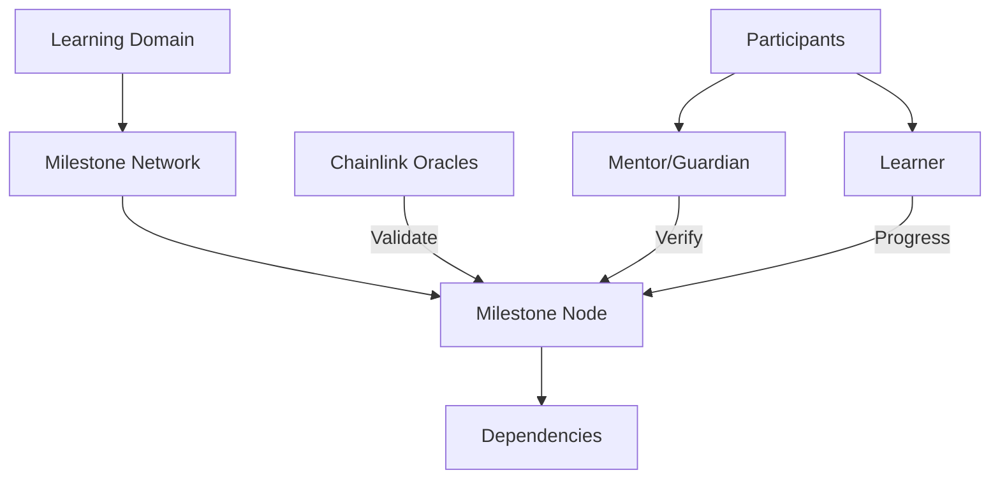

# Pioneering Chainlink Learning List

A decentralized learning progression tracker that leverages Chainlink infrastructure to create transparent, verifiable educational milestone tracking.

## Overview

Pioneering Chainlink Learning List is designed to create a collaborative, blockchain-powered environment for tracking educational achievements. By utilizing Chainlink's robust oracle network, the platform ensures secure, immutable recording of learning progressions while providing dynamic, visual representations of individual growth.

### Key Features
- Chainlink-powered learning progression tracking
- Decentralized milestone verification
- Immutable achievement records
- Multi-stakeholder collaborative platform
- Dynamic learning path generation
- Oracle-validated milestone dependencies

## Architecture

The Pioneering Chainlink Learning List leverages blockchain and Chainlink oracles to create a transparent, secure learning milestone management system.



### Core Components
- **Participants**: Four distinct roles (Admin, Mentor, Guardian, Learner)
- **Learning Domains**: Specialized knowledge collections
- **Milestone Nodes**: Granular learning achievements
- **Relationships**: Cross-participant connections
- **Progressions**: Chainlink-verified advancement tracking

## Contract Documentation

### chainlink-learning-tracker.clar
The primary contract managing learning progressions via Chainlink infrastructure.

#### Key Maps
- `learners`: Participant information registry
- `learning-domains`: Knowledge domain definitions
- `milestone-nodes`: Learning achievement structures
- `milestone-progressions`: Verified progression records
- `learner-relationships`: Authorized participant networks

#### Access Control
- Role-based permission management
- Relationship-driven verification
- Chainlink oracle validation mechanisms

## Getting Started

### Prerequisites
- Clarinet
- Stacks blockchain wallet
- Chainlink integration understanding

### Basic Usage

1. Register a participant:
```clarity
(contract-call? .chainlink-learning-tracker register-learner "Jane Smith" u2) ;; Register as mentor
```

2. Create a learning domain:
```clarity
(contract-call? .chainlink-learning-tracker create-learning-domain "Data Science" "Advanced analytics exploration")
```

3. Create a milestone node:
```clarity
(contract-call? .chainlink-learning-tracker create-milestone-node 
    "Machine Learning Foundations" 
    "Comprehensive ML concept introduction" 
    "AI/ML" 
    u2 
    u1 
    none)
```

## Function Reference

### Participant Management

```clarity
(register-learner (name (string-ascii 100)) (role uint))
(create-learner-relationship (related-user principal) (relationship-type (string-ascii 20)))
```

### Learning Domain Management

```clarity
(create-learning-domain (name (string-ascii 100)) (description (string-ascii 500)))
```

### Milestone Node Management

```clarity
(create-milestone-node (title (string-ascii 100)) 
                       (description (string-ascii 500))
                       (category (string-ascii 50))
                       (difficulty-level uint)
                       (domain-id uint)
                       (parent-milestone-id (optional uint)))
```

## Development

### Testing
1. Clone the repository
2. Install Clarinet
3. Run `clarinet test`
4. Use `clarinet console` for interactive exploration

### Local Development
1. Configure local Clarinet chain
2. Deploy contracts via `clarinet deploy`
3. Interact through console or programmatic interfaces

## Security Considerations

### Chainlink Integration
- Decentralized oracle verification
- Tamper-resistant progression tracking
- External data validation

### Access Control
- Granular role-based permissions
- Relationship-driven access management
- Immutable milestone dependency enforcement

### Best Practices
- Leverage Chainlink oracles for robust verification
- Maintain clear, structured learning trajectories
- Implement comprehensive access controls
- Continuously audit progression records